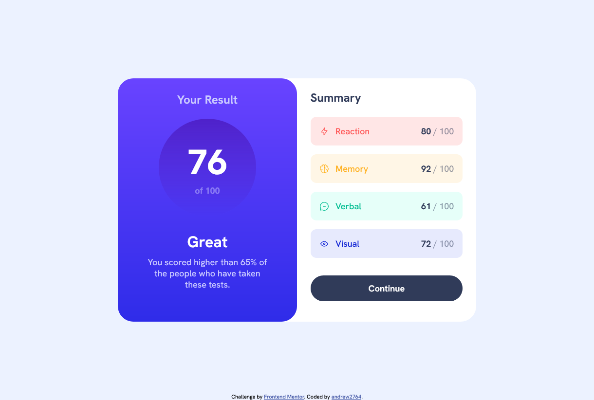
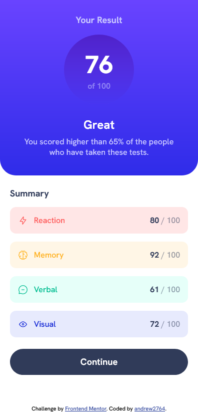

# Frontend Mentor - Results summary component solution

This is a solution to the [Results summary component challenge on Frontend Mentor](https://www.frontendmentor.io/challenges/results-summary-component-CE_K6s0maV). Frontend Mentor challenges help you improve your coding skills by building realistic projects. 

## Table of contents

- [Frontend Mentor - Results summary component solution](#frontend-mentor---results-summary-component-solution)
  - [Table of contents](#table-of-contents)
  - [Overview](#overview)
    - [The challenge](#the-challenge)
    - [Screenshot](#screenshot)
    - [Links](#links)
  - [My process](#my-process)
    - [Built with](#built-with)
    - [What I learned](#what-i-learned)
    - [Continued development](#continued-development)
  - [Author](#author)

## Overview

### The challenge

Users should be able to:

- View the optimal layout for the interface depending on their device's screen size
- See hover and focus states for all interactive elements on the page
- **Bonus**: Use the local JSON data to dynamically populate the content

### Screenshot

### Links

- Solution URL: https://www.frontendmentor.io/challenges/results-summary-component-CE_K6s0maV/hub
- Live Site URL: https://andrew2764.github.io/results-summary-component/

## My process

### Built with

- Vanilla HTML/CSS
- Flexbox
- BEM
- Mobile-first

### What I learned

Reinforcing what I already know. I can now directly write most of the code without looking anything up.

### Continued development

I'm continuing to use BEM as the naming convention in my CSS. Though naming things continue to be a challenge. I anticipate it to get much more difficult in larger projects.

I also didn't do the bonus challenge this time. Perhaps I will revisit this challange to do it when I'm more confident in using JS.

## Author

- Frontend Mentor - [@andrew2764](https://www.frontendmentor.io/profile/andrew2764)
- Twitter - [@andrew2764](https://www.twitter.com/andrew2764)
